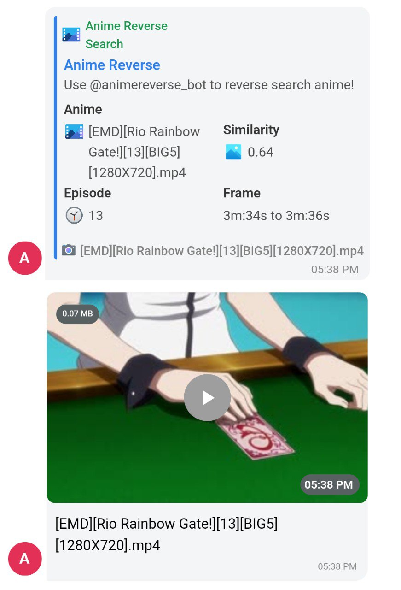

# Anime Reverse Search Bot

**Welcome to Anime Reverse Search Bot!**

Anime Reverse Search Bot is your go-to bot for discovering the origin of anime images and videos. Simply send an image or video to this bot, and it will perform a reverse search to find the anime it belongs to. Whether you're curious about a specific scene or want to identify a character, this bot has got you covered.

## How to Use

1. **Start Command**: Use the `/start` command to get a brief introduction to the bot and its capabilities.

2. **Reverse Image/Video**: Send an image or video to the bot directly or reply to an existing message with the `/reverse` command to initiate a reverse search.

## Commands

- **/start**: Get a quick overview of the bot and its functionalities.
- **/reverse**: Initiate a reverse search by sending an image or video to the bot.

## Usage Instructions

1. **Send Media**: Send an anime image or video to the bot. You can also reply to an existing message containing the media you want to search.

2. **Receive Results**: The bot will process the media and provide detailed information about the anime, including the episode and timeframe of the identified scene.

3. **Explore Further**: Click on the provided links in the embedded message to explore more about the identified anime.

## Setup Instructions

1. **Clone the Repository**: Clone this repository to your local machine using `git clone https://github.com/hummingbird28/AnimeReverse`.

2. **Install Dependencies**: Install the required Python packages using `pip install -r requirements.txt`.

3. **Set Environment Variables**: Create a `.env` file and add your Switch bot token as `BOT_TOKEN=your_bot_token_here`.

4. **Run the Bot**: Run the bot using `python main.py`.

5. **Start Searching**: Start using the bot on Switch and discover the origin of anime scenes with ease.

---

**Explore the anime world with Anime Reverse Search Bot!** 🌟